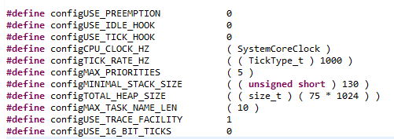

# FreeRTOS_M4
1) FreeRTOS_M4 - freeRTOS on STM32F407 ARM Cortex M4

The CubeIDE developed application can be run on an STM32F407 supported board. The freeRTOS application provides an example of Task Creation and Task Scheduling. 

Task Scheduling provides the option for both Preemptive and Cooperative Scheduling. Following is the output of the application with the Preemption Option - "configUSE_PREEMPTION" set to 1 in the FreeRTOSConfig.h file:

The configuration changes can be made by toggling the values in FreeRTOSConfig.h as shown below:

Following is the output of the application, now with the "configUSE_PREEMPTION" set to 0 in the FreeRTOSConfig.h file:

